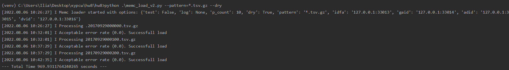

## О проекте
В данной работе сравниваются две версии одного скрипта, разница лишь в добавлении параллельной обработки
данных  
## Запуск
Пример запуска python , где p_count - количество параллельных потоков
```
python .\memc_load_v2.py --pattern=*.tsv.gz --dry --p_count 20
```
## Тесты запуска
  
  
